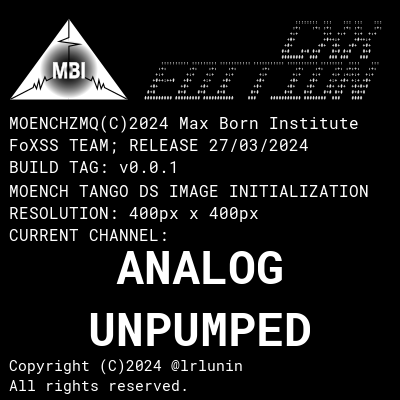
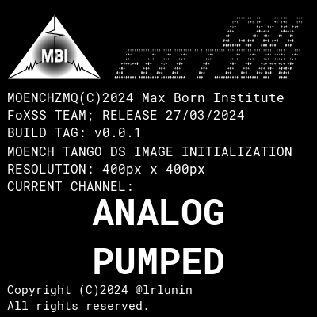

# tango-moench


Tango device servers both for control and online evaulation of the acquired images.

This implementation also allows both separation and simultaneous processing with different algorithms.

| | |
|-|-| 
|  |  | 

# Dependecies installation
## Probably available in package manager
### Ubuntu
`sudo apt install cmake g++ libzmq3-dev rapidjson-dev libfmt-dev libhdf5-dev libboost-dev`
### CentOS/RedHat
`sudo yum install cmake gcc-c++ zeromq-devel rapidjson-devel fmt-devel hdf5-devel boost-devel`

## Manual installation
### Tango Controls
Install with [original manual](https://tango-controls.readthedocs.io/en/latest/installation/index.html) in default path (no `--prefix ` option).

```bash
wget https://gitlab.com/api/v4/projects/24125890/packages/generic/TangoSourceDistribution/9.3.5/tango-9.3.5.tar.gz
tar xzvf tango-9.3.5.tar.gz && cd tango-9.3.5
./configure
make -j4
sudo make install
```

### slsDetectorPackage
Install the slsDetectorGroup libraries from [GitHub](https://github.com/slsdetectorgroup/slsDetectorPackage):

```bash
# clone the library
git clone https://github.com/slsdetectorgroup/slsDetectorPackage.git
cd slsDetectorGroup
# checkout the desired library version
git checkout tags/8.0.1
# create build folder
mkdir build && cd build
# maybe you can also set -DSLS_USE_DETECTOR=OFF and -DSLS_USE_RECEIVER=OFF
# if somehow you have to save space
cmake ../ -DSLS_DEVEL_HEADERS=ON -DSLS_USE_MOENCH=ON
# build the library
cmake --build .
# install the library (requires write access to /usr/lib etc)
sudo cmake --install .
```
# Package installation
```bash
git clone https://github.com/lrlunin/tango-moench.git
cd tango-moench
mkdir build && cd build
# configure the build files
cmake ../
# build the library
cmake --build .
# install the library (requires write access to /usr/lib etc)
sudo cmake --install .
```
# Help

Any additional information according to slsDetector, its python API or pytango references can be found under the links:

* [slsDetectorGroup wiki](https://slsdetectorgroup.github.io/devdoc/pydetector.html)
* [Tango Controls C++ reference](https://tango-controls.readthedocs.io/en/latest/getting-started/development/cpp/index.html)
# Authors

Contributors names and contact info

[@lrlunin](https://github.com/lrlunin)
